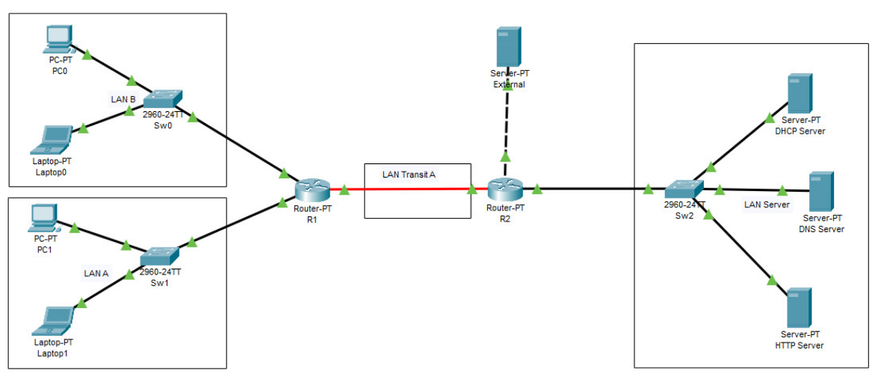

# Computer Networks Lab — ISEL

> Full corporate network infrastructure built across 4 progressive phases using Cisco Packet Tracer.

**Course:** Computer Networks · ISEL 2024/2025  

---

## Overview

This project builds a functional corporate network from scratch, phase by phase. Each phase extends the previous one — the final topology integrates everything: client LANs, inter-network routing, centralized services, and external connectivity.

<p align="center">
  
</p>

---

## Project Phases

### Phase 1 — Connecting Devices (LAN A & B)

First Cisco Packet Tracer setup: two network segments connected through a single router.

**Subnetting** applied from `10.0.6.0/24`:

| Subnet | Range | Mask | Use |
|---|---|---|---|
| `10.0.6.0/25` | .0 – .127 | 255.255.255.128 | LAN B |
| `10.0.6.128/25` | .128 – .255 | 255.255.255.128 | LAN A |

**Router R1:**
- `FastEthernet0/0` → `10.0.6.126` (LAN B gateway)
- `FastEthernet1/0` → `10.0.6.254` (LAN A gateway)

**Validation:** 100% ping success between devices across both LANs. Routing table confirmed with `show ip route`.

---

### Phase 2 — Connecting Multiple Networks

Expanded to a multi-router topology with a dedicated server LAN and simulated external access.

**Hierarchical subnetting (VLSM)** from `10.0.6.0/24`:

| Subnet | CIDR | Usable hosts | Use |
|---|---|---|---|
| `10.0.6.0` | `/25` | 126 | LAN A (80 clients) |
| `10.0.6.128` | `/26` | 62 | LAN B (40 clients) |
| `10.0.6.224` | `/27` | 30 | Server LAN |
| `10.0.6.192` | `/30` | 2 | Transit A (R1 ↔ R2) |

> Client count derived from student numbers:  
> `(51392 + 51394 + 51694) mod 100 = 80` → LAN A: 80, LAN B: 40

**Static routing configured:**

```
# Router R1
ip route 10.0.6.224 255.255.255.224 10.0.6.194   # → Server LAN via R2
ip route 8.8.8.0 255.255.255.252 10.0.6.194       # → default (Internet)

# Router R2
ip route 10.0.6.0 255.255.255.128 10.0.6.193      # → LAN A via R1
ip route 10.0.6.128 255.255.255.192 10.0.6.193    # → LAN B via R1
```

**Validation:** ping from Laptop1 (LAN A) to `8.8.8.1` (external) successful. Full connectivity across all subnets verified.

---

### Phase 3 — Deploy Services

Network services deployed on top of the Phase 3 topology. Clients no longer use static IPs — everything is assigned automatically.

#### DHCP

Server at `10.0.6.225` with three address pools:

| Pool | Start IP | Gateway | DNS |
|---|---|---|---|
| `LAN_A` | `10.0.6.1` | `10.0.6.126` | `10.0.6.226` |
| `LAN_B` | `10.0.6.129` | `10.0.6.190` | `10.0.6.226` |
| `serverPool` | `10.0.6.224` | `200.0.3.1` | `200.0.3.101` |

Since the DHCP server sits on a separate subnet from the clients, a **DHCP Relay Agent** was configured on each router interface facing the client LANs:

```
ip helper-address 10.0.6.225
```

The router converts client DHCP broadcasts into unicast messages directed at the server, including the originating subnet so the correct pool is selected.

#### DNS

Server at `10.0.6.226`. Record configured:

```
www.company.com  →  A Record  →  10.0.6.227
```

#### HTTP / HTTPS

Web server at `10.0.6.227` with ports 80 and 443 active.

**Validation:**
```
nslookup www.company.com   # resolves to 10.0.6.227
ping www.company.com        # 4/4 packets, 0% loss
http://www.company.com      # page loaded successfully from PC1 and PC0
```

#### ARP Table — observed behaviour

- Initial state: `No ARP Entries Found` (no prior communication)
- After PC1 pinged the DHCP server: entry `10.0.6.254` (router gateway) created dynamically
- After disabling and re-enabling the interface: table cleared again

---

## Tools & Stack

| Tool | Use |
|---|---|
| Cisco Packet Tracer 8.2 | Full network simulation |
| Wireshark | Protocol analysis (Phase 1) |
| Cisco IOS CLI | Router configuration and verification |

**Protocols covered:** IPv4, ICMP, ARP, DHCP (DORA), DNS, HTTP, HTTPS, static routing

---

## References

- Kurose, J. F.; Ross, K. W. (2021). *Computer Networking: A Top-Down Approach* (8th ed.). Pearson.
- Cisco Systems. *Cisco Packet Tracer*, version 8.2.
- Course slides: Chapter 4 – Network Layer; Chapter 5 – Link Layer. ISEL 2025.
